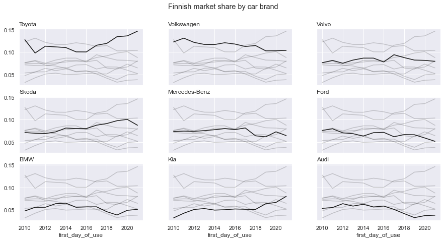

<script src="https://cdnjs.cloudflare.com/ajax/libs/require.js/2.3.6/require.min.js" integrity="sha512-c3Nl8+7g4LMSTdrm621y7kf9v3SDPnhxLNhcjFJbKECVnmZHTdo+IRO05sNLTH/D3vA6u1X32ehoLC7WFVdheg==" crossorigin="anonymous"></script>
<script src="https://cdnjs.cloudflare.com/ajax/libs/jquery/3.5.1/jquery.min.js" integrity="sha512-bLT0Qm9VnAYZDflyKcBaQ2gg0hSYNQrJ8RilYldYQ1FxQYoCLtUjuuRuZo+fjqhx/qtq/1itJ0C2ejDxltZVFg==" crossorigin="anonymous"></script>
<script type="application/javascript">define('jquery', [],function() {return window.jQuery;})</script>


### Cars in Finland

The Finnish Transport and Communications Agency [Traficom](https://www.traficom.fi/en/) shares some open datasets on their website. Here we are going to be looking at [open data for vehicles](https://www.traficom.fi/en/news/open-data?toggle=Open%20data%20for%20vehicles).

Maybe we can learn something about the cars people drive in Finland?

### Start with the mandatory imports

I will be using Pandas for processing the data and Seaborn-Matplotlib combo for any visualizations.

``` python
import pandas as pd
import matplotlib.pyplot as plt
import seaborn as sns

sns.set_theme()
sns.set_style('darkgrid')
sns.set_context('notebook')
```

### Load the data

At the moment of writing, the latest vehicles dataset is a CSV file of 981 MB (200 MB when compressed to a ZIP file). It was published 2022-06-21, just in time for Juhannus!

Loading the data into a Pandas DataFrame is quite easy and painless.

``` python
df = pd.read_csv(
    'https://opendata.traficom.fi/Content/Ajoneuvorekisteri.zip',
    encoding='latin-1',
    sep=';',
    low_memory=False)
df.info()
```

    <class 'pandas.core.frame.DataFrame'>
    RangeIndex: 5236787 entries, 0 to 5236786
    Data columns (total 38 columns):
     #   Column                     Dtype  
    ---  ------                     -----  
     0   ajoneuvoluokka             object 
     1   ensirekisterointipvm       object 
     2   ajoneuvoryhma              float64
     3   ajoneuvonkaytto            float64
     4   variantti                  object 
     5   versio                     object 
     6   kayttoonottopvm            int64  
     7   vari                       object 
     8   ovienLukumaara             float64
     9   korityyppi                 object 
     10  ohjaamotyyppi              float64
     11  istumapaikkojenLkm         float64
     12  omamassa                   float64
     13  teknSuurSallKokmassa       float64
     14  tieliikSuurSallKokmassa    float64
     15  ajonKokPituus              float64
     16  ajonLeveys                 float64
     17  ajonKorkeus                float64
     18  kayttovoima                object 
     19  iskutilavuus               float64
     20  suurinNettoteho            float64
     21  sylintereidenLkm           float64
     22  ahdin                      object 
     23  sahkohybridi               object 
     24  sahkohybridinluokka        float64
     25  merkkiSelvakielinen        object 
     26  mallimerkinta              object 
     27  vaihteisto                 object 
     28  vaihteidenLkm              float64
     29  kaupallinenNimi            object 
     30  voimanvalJaTehostamistapa  float64
     31  tyyppihyvaksyntanro        object 
     32  yksittaisKayttovoima       object 
     33  kunta                      float64
     34  Co2                        float64
     35  matkamittarilukema         float64
     36  valmistenumero2            object 
     37  jarnro                     int64  
    dtypes: float64(20), int64(2), object(16)
    memory usage: 1.5+ GB

It looks like more than five million vehicles have been registered in Finland. There's a total of 38 columns in the data but the column names are in -- no, that is not some mysterious demon language -- Finnish, of course!

Luckily Traficom shares a description of the columns and what's inside them in an additional Excel file. Descriptions are offered in Finnish, Swedish, and English.

Reading the metadata with Pandas is easy. For brevity, I'll show here just the first five rows.

``` python
column_info = pd.read_excel(
    'https://www.traficom.fi/sites/default/files/media/file/Ajoneuvotiedot_avoin_data_luokitukset_22_02_2022.xlsx',
    sheet_name='MUUTTUJALUETTELO',
    usecols=[1, 2, 3, 4],
    skiprows=3)
column_info.head(5)
```

<div>
<style scoped>
    .dataframe tbody tr th:only-of-type {
        vertical-align: middle;
    }

    .dataframe tbody tr th {
        vertical-align: top;
    }

    .dataframe thead th {
        text-align: right;
    }
</style>
<table border="1" class="dataframe">
  <thead>
    <tr style="text-align: right;">
      <th></th>
      <th>tieto</th>
      <th>kuvaus</th>
      <th>Beskrivning</th>
      <th>Description in brief</th>
    </tr>
  </thead>
  <tbody>
    <tr>
      <th>0</th>
      <td>ajoneuvoluokka</td>
      <td>Ajoneuvon direktiivin mukainen luokittelu.</td>
      <td>Fordons klassificering enligt direktivet</td>
      <td>Vehicle classification according to the direct...</td>
    </tr>
    <tr>
      <th>1</th>
      <td>ensirekisterointipvm</td>
      <td>Ajoneuvon ensirekisteröintipäivä.</td>
      <td>Datum för första registrering</td>
      <td>Date of first registration</td>
    </tr>
    <tr>
      <th>2</th>
      <td>ajoneuvoryhma</td>
      <td>Ajoneuvoluokkaa tarkempi luokittelu ajoneuvoille</td>
      <td>Mer exakt klassificering för fordon</td>
      <td>More accurate classification for vehicles</td>
    </tr>
    <tr>
      <th>3</th>
      <td>ajoneuvonkaytto</td>
      <td>Ajoneuvon käyttötieto.</td>
      <td>Information om fordonsanvändning</td>
      <td>Vehicle usage information</td>
    </tr>
    <tr>
      <th>4</th>
      <td>variantti</td>
      <td>Ajoneuvon variantin yksilöivä tunniste</td>
      <td>Unik identifierare för fordonets variant</td>
      <td>Unique identifier of the vehicle variant</td>
    </tr>
  </tbody>
</table>
</div>

The metadata table does not provide us with an easy mapping between the Finnish and English names, so I will not rename the columns. Nevertheless, the metadata can serve as a handy reference for the non-Finnish speakers.

As mentioned before, the same Excel also contains explanations for the values found in the columns. For example `ajoneuvoluokka` or vehicle classification should have this kind of values (again showing just the first five rows for brevity):

``` python
vehicle_classification = pd.read_excel(
    'https://www.traficom.fi/sites/default/files/media/file/Ajoneuvotiedot_avoin_data_luokitukset_22_02_2022.xlsx',
    sheet_name='AJONEUVOLUOKKA',
    skiprows=6)
vehicle_classification.head()
```

<div>
<style scoped>
    .dataframe tbody tr th:only-of-type {
        vertical-align: middle;
    }

    .dataframe tbody tr th {
        vertical-align: top;
    }

    .dataframe thead th {
        text-align: right;
    }
</style>
<table border="1" class="dataframe">
  <thead>
    <tr style="text-align: right;">
      <th></th>
      <th>KOODINTUNNUS</th>
      <th>LYHYTSELITE</th>
      <th>PITKASELITE</th>
      <th>LYHYTSELITE_sv</th>
      <th>PITKASELITE_sv</th>
      <th>LYHYTSELITE_en</th>
      <th>PITKASELITE_en</th>
    </tr>
  </thead>
  <tbody>
    <tr>
      <th>0</th>
      <td>C1</td>
      <td>Traktori</td>
      <td>Telaketjutraktori, v &lt;= 40 km/h, m &gt; 600 kg, m...</td>
      <td>Traktor</td>
      <td>Bandtraktor, v &lt;= 40 km/h, m &gt; 600 kg, markfri...</td>
      <td>Tractor</td>
      <td>Tractor</td>
    </tr>
    <tr>
      <th>1</th>
      <td>C2</td>
      <td>Traktori</td>
      <td>Telaketjutraktori, v &lt;= 40 km/h, m &gt; 600 kg, m...</td>
      <td>Traktor</td>
      <td>Bandtraktor, v &lt;= 40 km/h, m &gt; 600 kg, markfri...</td>
      <td>Tractor</td>
      <td>Tractor</td>
    </tr>
    <tr>
      <th>2</th>
      <td>C3</td>
      <td>Traktori</td>
      <td>Telaketjutraktori, v &lt;= 40 km/h, m &lt;= 600 kg</td>
      <td>Traktor</td>
      <td>Bandtraktor, v &lt;= 40 km/h, m &lt;= 600 kg</td>
      <td>Tractor</td>
      <td>Tractor</td>
    </tr>
    <tr>
      <th>3</th>
      <td>C4</td>
      <td>Traktori</td>
      <td>Erityiskäyttöön tarkoitettu telaketjutraktori,...</td>
      <td>Traktor</td>
      <td>Bandtraktor konstruerad för ett särskilt ändam...</td>
      <td>Tractor</td>
      <td>Tractor</td>
    </tr>
    <tr>
      <th>4</th>
      <td>C5</td>
      <td>Traktori</td>
      <td>Telaketjutraktori, v &gt; 40 km/h</td>
      <td>Traktor</td>
      <td>Bandtraktor, v &gt; 40 km/h</td>
      <td>Tractor</td>
      <td>Tractor</td>
    </tr>
  </tbody>
</table>
</div>

### Cars!

Based on the vehicle classification metadata, it seems like there's information about lots of different vehicles besides just regular cars. If I am interested in the cars regular people drive (henkilöauto in Finnish), classifications `M1` (cars) and `M1G` (off-road cars) look like good candidates. One could also consider `N1` and `N1G` (vans and off-road vans, respectively).

Gotta love those verbose English descriptions!

``` python
vehicle_classification.query('KOODINTUNNUS.str.startswith("M1")')
```

<div>
<style scoped>
    .dataframe tbody tr th:only-of-type {
        vertical-align: middle;
    }

    .dataframe tbody tr th {
        vertical-align: top;
    }

    .dataframe thead th {
        text-align: right;
    }
</style>
<table border="1" class="dataframe">
  <thead>
    <tr style="text-align: right;">
      <th></th>
      <th>KOODINTUNNUS</th>
      <th>LYHYTSELITE</th>
      <th>PITKASELITE</th>
      <th>LYHYTSELITE_sv</th>
      <th>PITKASELITE_sv</th>
      <th>LYHYTSELITE_en</th>
      <th>PITKASELITE_en</th>
    </tr>
  </thead>
  <tbody>
    <tr>
      <th>19</th>
      <td>M1</td>
      <td>Henkilöauto</td>
      <td>Matkustajien kuljettamiseen valmistettu ajoneu...</td>
      <td>Personbil</td>
      <td>Ett för persontransport tillverkat fordon med ...</td>
      <td>Car</td>
      <td>Car</td>
    </tr>
    <tr>
      <th>20</th>
      <td>M1G</td>
      <td>Henkilöauto</td>
      <td>Matkustajien kuljettamiseen valmistettu maasto...</td>
      <td>Personbil</td>
      <td>En för persontransport tillverkad terrängbil m...</td>
      <td>Car</td>
      <td>Car</td>
    </tr>
  </tbody>
</table>
</div>

``` python
df.query('ajoneuvoluokka.str.startswith("M1")', inplace=True)
df.info()
```

    <class 'pandas.core.frame.DataFrame'>
    Int64Index: 2772248 entries, 2 to 5236786
    Data columns (total 38 columns):
     #   Column                     Dtype  
    ---  ------                     -----  
     0   ajoneuvoluokka             object 
     1   ensirekisterointipvm       object 
     2   ajoneuvoryhma              float64
     3   ajoneuvonkaytto            float64
     4   variantti                  object 
     5   versio                     object 
     6   kayttoonottopvm            int64  
     7   vari                       object 
     8   ovienLukumaara             float64
     9   korityyppi                 object 
     10  ohjaamotyyppi              float64
     11  istumapaikkojenLkm         float64
     12  omamassa                   float64
     13  teknSuurSallKokmassa       float64
     14  tieliikSuurSallKokmassa    float64
     15  ajonKokPituus              float64
     16  ajonLeveys                 float64
     17  ajonKorkeus                float64
     18  kayttovoima                object 
     19  iskutilavuus               float64
     20  suurinNettoteho            float64
     21  sylintereidenLkm           float64
     22  ahdin                      object 
     23  sahkohybridi               object 
     24  sahkohybridinluokka        float64
     25  merkkiSelvakielinen        object 
     26  mallimerkinta              object 
     27  vaihteisto                 object 
     28  vaihteidenLkm              float64
     29  kaupallinenNimi            object 
     30  voimanvalJaTehostamistapa  float64
     31  tyyppihyvaksyntanro        object 
     32  yksittaisKayttovoima       object 
     33  kunta                      float64
     34  Co2                        float64
     35  matkamittarilukema         float64
     36  valmistenumero2            object 
     37  jarnro                     int64  
    dtypes: float64(20), int64(2), object(16)
    memory usage: 824.9+ MB

Wow, that still leaves us with almost three million vehicles! I wonder how they are distributed over time? For that I will use `kayttoonottopvm` because it seems compatible with some other numbers based on quick Google sanity check.

``` python
df['first_day_of_use'] = pd.to_datetime(
    df['kayttoonottopvm'],
    format='%Y%m%d',
    errors='coerce')

df.resample('Y', on='first_day_of_use').ajoneuvoluokka.count().plot(figsize=(10, 6))
```

    <AxesSubplot:xlabel='first_day_of_use'>


Hmm, the latest yearly values of cars seem sensible and agree with the latest news about the number of new cars registered, but I am not sure about the older datapoints. [The documentation](https://www.traficom.fi/sites/default/files/media/file/Avoin%20Data%2010%20kysytyint%C3%A4%20kysymyst%C3%A4.pdf) on Traficom's website reveals that the data only contains vehicles that have not been decommissioned. That might explain things. It's probably better to focus on the last ten years or so for any analysis as the numbers don't exactly match e.g. the ones shown on [the website of Autoalan Tiedotuskeskus](https://www.aut.fi/tilastot/ensirekisteroinnit/ensirekisterointien_vuosittainen_kehitys) even though they are in the right ballpark.

### What's the most popular car brand in Finland?

There's a gazilliong things you could dig out of this dataset but let's just pick one thing here: In the last ten years or so, what are the most popular car brands in Finland?

As a first step, let's look at the 30 most popular brands from 2010 onwards:

``` python
df.query('first_day_of_use > "2009-12-31"')['merkkiSelvakielinen'].value_counts().head(30)
```

    Toyota            174487
    Volvo             122651
    Skoda             121543
    Volkswagen, VW    120403
    Mercedes-Benz     108587
    Ford              100140
    BMW                79618
    Kia                79095
    Audi               75403
    Nissan             73693
    Opel               59574
    Volkswagen         49822
    Hyundai            40568
    Peugeot            34295
    Renault            28302
    Honda              27353
    Citroen            25814
    Seat               22952
    Mitsubishi         22306
    Mazda              20283
    Subaru             11817
    Suzuki             11708
    Dacia              11635
    Tesla               6697
    Fiat                6289
    Lexus               5180
    Chevrolet           4848
    Mini                4128
    Porsche             3873
    Land Rover          3455
    Name: merkkiSelvakielinen, dtype: int64

Makes sort of sense, Toyota is popular here... but wait! Why do we have both `Volkswagen, VW` and `Volkswagen` in there? Well, as they say, 90% of data science work is cleaning data, and we are not even doing that much data science here. There's probably more dirty data beneath the surface but let's just clean this Volkswagen part:

``` python
df['merkkiSelvakielinen'].replace({'Volkswagen, VW': 'Volkswagen'}, inplace=True)
df.query('first_day_of_use > "2009-12-31"')['merkkiSelvakielinen'].value_counts().head(5)
```

    Toyota           174487
    Volkswagen       170225
    Volvo            122651
    Skoda            121543
    Mercedes-Benz    108587
    Name: merkkiSelvakielinen, dtype: int64

Seems like that did the trick. Now it's a red hot race between Toyota and Volkswagen, a real nail-biter! Let's look at how the "market shares" of the top 9 brands have evolved in the recent years.

Probably there would be an easier way to do this with e.g. Seaborn but let's hack the [small multiple](https://en.wikipedia.org/wiki/Small_multiple) plot with just Matplotlib. Pardon for the aggressive chaining of Pandas methods!

``` python
brands_to_include = [
    'Toyota',
    'Volkswagen',
    'Volvo',
    'Skoda',
    'Mercedes-Benz',
    'Ford',
    'BMW',
    'Kia',
    'Audi',
]

# Filter in only the data we want
df_top_9 = (
    df
    .query('merkkiSelvakielinen == @brands_to_include')
    .query('first_day_of_use > "2009-12-31"')
    .query('first_day_of_use < "2022-01-01"') # Include only full years
)

# Groupby, aggregate count of rows, and pivot
df_top_9 = (
    df_top_9
    .groupby(
        [df_top_9.first_day_of_use.dt.year, df_top_9.merkkiSelvakielinen],
        as_index=True)['ajoneuvoluokka']
    .count()
    .reset_index()
    .pivot(
        index='first_day_of_use',
        columns='merkkiSelvakielinen', 
        values='ajoneuvoluokka')
    .fillna(0)
)

# Normalize monthly values
df_top_9 = df_top_9.divide(df_top_9.sum(axis=1), axis=0)

# Plot small multiples
fig, ax = plt.subplots(3, 3, figsize=(15, 7), sharex=True, sharey=True)
for ix, col in enumerate(df_top_9.columns):
    plt.subplot(3, 3, ix+1)
    df_top_9[col].plot(color='k', linewidth=1.5)
    plt.title(col, loc='left')

_ = plt.suptitle('Finnish market share by car brand')
```



One could argue the following trends based on the data:
- Volkswagen is declining steadily, although Skoda from the same conglomerate has been going up until 2021.
- Kia has been increasing their market share in the recent years. This makes sense if you have been reading the headlines on the car market in Finland.
- Toyota has been increasing their market share in the recent years. Toyota has always been a popular and respectable choice for a family car in Finland, and perhaps their investments in the hybrid technology are paying off?

### What could be next?

I will stop here with this toy analysis, but there are some more interesting but also more laborious questions that you could try to answer based on this dataset. For example:
- Do Finns buy (or at least register) more electric or hybrid cars? The data has information about this in the columns `kayttovoima`, `sahkohybridi`, and `sahkohybridinluokka` but a quick glance indicates that they would require some cleaning.
- Have the cars got cleaner over time, i.e. do they emit less CO2 emissions? There's the `Co2` column in the data that could be used here.
- If they have got cleaner, is that on the expense of performance? I think `suurinNettoteho` would be helpful here.

If you got this far, why not go ahead and [watch the music video for Gary Numan's Cars](https://www.youtube.com/watch?v=Im3JzxlatUs)?
